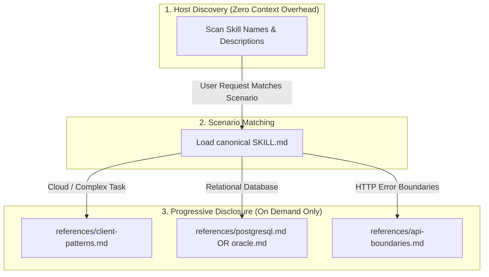
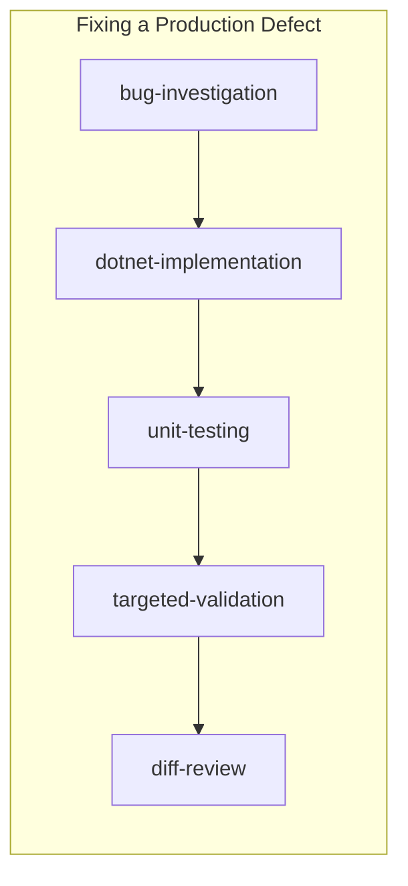
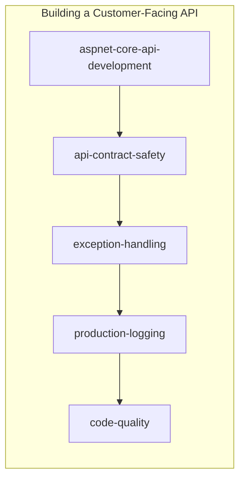
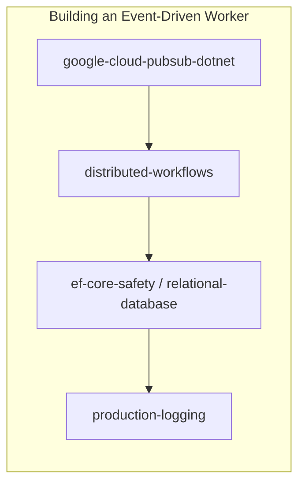

# .NET Production Agent Skills

<div align="center">

[](https://dprakash2101.github.io/dotnet-production-agent-skills/)
[](LICENSE)
[](https://agentskills.io/specification)

## Practical .NET guidance for coding agents

A focused collection of `SKILL.md` guidance built to reduce repeated prompting, unnecessary token use, and avoidable rework when developing production .NET software with AI coding tools.

[Browse the skills catalog](https://dprakash2101.github.io/dotnet-production-agent-skills/#skills) · [Build an install command](https://dprakash2101.github.io/dotnet-production-agent-skills/#install) · [Release notes](RELEASE_NOTES.md) · [Report an issue](https://github.com/dprakash2101/dotnet-production-agent-skills/issues)

</div>

---

## Table of Contents

- [Overview & Core Philosophy](#overview--core-philosophy)
- [Architecture & Progressive Disclosure](#architecture--progressive-disclosure)
- [Quick Start](#quick-start)
- [Skills Catalog](#skills-catalog)
  - [🧭 Workflow & Orientation](#1--workflow--orientation)
  - [🏗️ Architecture & Core Implementation](#2-️-architecture--core-implementation)
  - [🛡️ API Contracts & Boundaries](#3-️-api-contracts--boundaries)
  - [🧪 Quality, Testing & Review](#4--quality-testing--review)
  - [☁️ Cloud & Database Engineering](#5-️-cloud--database-engineering)
  - [⚡ Distributed Resilience & Security](#6-️-distributed-resilience--security)
  - [🔍 Incident Response & Diagnosis](#7--incident-response--diagnosis)
- [Composition Workflows](#composition-workflows)
- [Quality Policies & Standards](#quality-policies--standards)
- [TypeScript CLI Reference](#typescript-cli-reference)
  - [Installation Targets & Paths](#installation-targets--paths)
  - [Safety & Conflict Handling](#safety--conflict-handling)
- [Host Compatibility](#host-compatibility)
- [Validation & Development](#validation--development)
- [Release Notes](#release-notes)
- [Why I built this](#why-i-built-this)
- [License](#license)

---

## Overview & Core Philosophy

**dotnet-production-agent-skills** captures reusable production guidance for coding agents working on modern .NET and ASP.NET Core codebases. It maintains one canonical source of truth and uses a small TypeScript installer to adapt that content to supported agent discovery locations.

The repository maintains **one canonical source of truth**:

```text
skills/ (canonical portable Agent Skills)
  ├── focused SKILL.md specifications
  └── targeted references/ (deep dive technical guides)
         │
         ▼
  TypeScript Adapter (dist/src/cli.js)
         │
         ├── Codex         →  .agents/skills
         ├── GitHub Copilot →  .github/skills | .copilot/skills
         ├── Claude Code   →  .claude/skills
         ├── Cursor        →  .cursor/skills | .agents/skills
         └── Antigravity   →  .agents/skills + .agents/hooks.json
```

### Core Engineering Invariant

> **Implement the requested behavior without changing unrelated behavior.**
>
> Task size changes investigation depth and validation rigor — never baseline safety standards.

- **No Hallucinated Edits**: Narrow, intentional changes that preserve existing patterns.
- **Progressive Context Disclosure**: Prevents token waste by loading comprehensive reference guides only when the specific scenario demands it.
- **Vendor Agnostic**: Adheres to the portable [Agent Skills specification](https://agentskills.io/specification). Guidance is maintained in one place rather than duplicated across agent ecosystems.

---

## Architecture & Progressive Disclosure

Agents initially ingest only skill **names** and **descriptions**. When a task activates a skill, its concise `SKILL.md` is loaded. Specialized references (e.g. ADO.NET connection pools, BigQuery cost minimization, or API boundary error handling) are pulled into context only on demand:



This layout ensures an ordinary controller edit does not saturate the agent's context window with Pub/Sub, BigQuery, Firestore, and Oracle rules.

---

## Quick Start

Choose the smallest command that matches how you work. Copy mode is the recommended default because it is portable and easy to inspect.

```sh
# Recommended: install for supported agents on this machine
npx dotnet-production-agent-skills install --target all

# Keep the installation inside the current repository
npx dotnet-production-agent-skills install --target all --scope project

# Install for one agent only
npx dotnet-production-agent-skills install --target copilot
```

| Choice | Use it when | Flag |
| :--- | :--- | :--- |
| **All agents** | You use more than one supported coding agent. | `--target all` |
| **One agent** | You only want Codex, Copilot, Claude Code, or Cursor. | `--target <agent>` |
| **My machine** | You want skills available across repositories. | default user scope |
| **This project** | You want repository-specific installation. | `--scope project` |
| **Copy** | You want the safest, portable installation. | default mode |
| **Link** | You are developing the skill library locally. | `--mode link` |

### From Local Checkout

```sh
# Clone and build
git clone https://github.com/dprakash2101/dotnet-production-agent-skills.git
cd dotnet-production-agent-skills
npm install
npm run build

# Run health check & dry run
node dist/src/cli.js doctor --target all
node dist/src/cli.js install --target all --dry-run

# Perform installation
node dist/src/cli.js install --target all
```

Shell and PowerShell scripts are also provided:

```sh
# POSIX (Linux / macOS)
./scripts/install-skills.sh --target all

# Windows PowerShell
./scripts/install-skills.ps1 -Target all
```

---

## Skills Catalog

The catalog is grouped by task so agents can load only the guidance relevant to the current work. Use the [interactive catalog](https://dprakash2101.github.io/dotnet-production-agent-skills/#skills) to search by technology, workflow, or engineering concern.

### 1. 🧭 Workflow & Orientation

| Skill | Focus & Trigger | Progressive References |
| :--- | :--- | :--- |
| [`task-router`](skills/task-router/SKILL.md) | Classify requests to select the smallest proportionate workflow when the path forward is ambiguous. | — |
| [`context-reset`](skills/context-reset/SKILL.md) | Reorient safely when user instructions interrupt, pivot, or invalidate an in-progress coding task. | — |
| [`safe-terminal`](skills/safe-terminal/SKILL.md) | Execute shell commands safely, handle failures, and prevent accidental mutations or credential leaks. | — |
| [`poc-development`](skills/poc-development/SKILL.md) | Build bounded, explicit spikes or prototypes to answer technical questions without cutting production corners prematurely. | — |

### 2. 🏗️ Architecture & Core Implementation

| Skill | Focus & Trigger | Progressive References |
| :--- | :--- | :--- |
| [`dotnet-architecture`](skills/dotnet-architecture/SKILL.md) | Design and preserve clean boundaries, layering, and DI registrations for substantial changes. | [architecture-patterns](skills/dotnet-architecture/references/architecture-patterns.md) |
| [`dotnet-implementation`](skills/dotnet-implementation/SKILL.md) | Implement robust production .NET & ASP.NET Core behavior adhering to established repository conventions. | [idiomatic-csharp](skills/dotnet-implementation/references/idiomatic-csharp.md) |
| [`shared-code-impact`](skills/shared-code-impact/SKILL.md) | Identify all consumers, analyze ripple effects, and strictly constrain changes to shared libraries/helpers. | — |
| [`dependency-management`](skills/dependency-management/SKILL.md) | Assess, add, prune, or upgrade NuGet dependencies conservatively without breaking transitive graphs. | — |

### 3. 🛡️ API Contracts & Boundaries

| Skill | Focus & Trigger | Progressive References |
| :--- | :--- | :--- |
| [`aspnet-core-api-development`](skills/aspnet-core-api-development/SKILL.md) | Build thin controllers/minimal APIs with validation, structured responses, and complete OpenAPI specs. | — |
| [`api-contract-safety`](skills/api-contract-safety/SKILL.md) | Guard HTTP contracts against unintended breaking changes across routes, payloads, error formats, and headers. | — |
| [`api-endpoint-deprecation`](skills/api-endpoint-deprecation/SKILL.md) | Execute formal multi-stage API deprecation, migration windows, consumer verification, and safe retirement. | — |
| [`exception-handling`](skills/exception-handling/SKILL.md) | Establish clear recovery, translation, cancellation, and logging boundaries across .NET application tiers. | [api-boundaries](skills/exception-handling/references/api-boundaries.md) |

### 4. 🧪 Quality, Testing & Review

| Skill | Focus & Trigger | Progressive References |
| :--- | :--- | :--- |
| [`code-quality`](skills/code-quality/SKILL.md) | Apply Clean-as-You-Code principles, Roslyn analyzers, and Sonar expectations to new/modified code. | — |
| [`unit-testing`](skills/unit-testing/SKILL.md) | Target 90–100% meaningful coverage of new business logic using parameterized tests without test bloat. | — |
| [`code-review`](skills/code-review/SKILL.md) | Review diffs rigorously for correctness, security, concurrency, performance, and regression risks. | — |
| [`targeted-validation`](skills/targeted-validation/SKILL.md) | Run proportionate verification (from single-test execution to full suite runs) aligned with change risk. | — |
| [`diff-review`](skills/diff-review/SKILL.md) | Perform a final pre-commit audit of working tree diffs for accidental mutations, formatting drift, and secrets. | — |

### 5. ☁️ Cloud & Database Engineering

| Skill | Focus & Trigger | Progressive References |
| :--- | :--- | :--- |
| [`ef-core-safety`](skills/ef-core-safety/SKILL.md) | Prevent N+1 queries, audit DbContext lifecycles, manage transactions, and write safe migrations. | — |
| [`relational-database-dotnet`](skills/relational-database-dotnet/SKILL.md) | Execute high-performance ADO.NET access, connection lifecycle, and parameterized queries for PostgreSQL & Oracle. | [postgresql](skills/relational-database-dotnet/references/postgresql.md), [oracle](skills/relational-database-dotnet/references/oracle.md) |
| [`google-cloud-pubsub-dotnet`](skills/google-cloud-pubsub-dotnet/SKILL.md) | Implement robust Google Cloud Pub/Sub publishers and pull subscribers with proper ack/nack semantics. | [client-patterns](skills/google-cloud-pubsub-dotnet/references/client-patterns.md) |
| [`google-bigquery-dotnet`](skills/google-bigquery-dotnet/SKILL.md) | Query BigQuery with parameterization, pagination, streaming buffers, and strict query-cost awareness. | [query-safety](skills/google-bigquery-dotnet/references/query-safety.md) |
| [`google-firestore-dotnet`](skills/google-firestore-dotnet/SKILL.md) | Model Firestore documents, transactions, and batched writes with concurrency and read-cost awareness. | — |
| [`redis-dotnet`](skills/redis-dotnet/SKILL.md) | Design secure .NET Redis caches, expiration, invalidation, and token protection. | — |

### 6. ⚡ Distributed Resilience & Security

| Skill | Focus & Trigger | Progressive References |
| :--- | :--- | :--- |
| [`distributed-workflows`](skills/distributed-workflows/SKILL.md) | Build idempotent consumers, handle partial failures, manage distributed retries, and design background workers. | — |
| [`retry-resilience`](skills/retry-resilience/SKILL.md) | Add explicitly requested retries or review existing transient failure policies; avoid automatic retries. | — |
| [`dotnet-security`](skills/dotnet-security/SKILL.md) | Threat-model .NET boundaries, protect against SSRF/XSS/SQLi, enforce authorization, and handle secrets safely. | — |
| [`production-logging`](skills/production-logging/SKILL.md) | Produce structured, high-signal, sensitive-data-masked, and cost-efficient Serilog/ILogger production logs. | — |

### 7. 🔍 Incident Response & Diagnosis

| Skill | Focus & Trigger | Progressive References |
| :--- | :--- | :--- |
| [`bug-investigation`](skills/bug-investigation/SKILL.md) | Isolate symptoms to an empirical root cause before proposing or writing code modifications. | — |
| [`production-debugging`](skills/production-debugging/SKILL.md) | Diagnose production failures from telemetry, dumps, traces, and metrics without mutating live state. | — |
| [`production-hotfix`](skills/production-hotfix/SKILL.md) | Formulate and validate emergency incident hotfixes with minimal blast radius and rapid evidence-based testing. | — |
| [`git-workflow`](skills/git-workflow/SKILL.md) | Carry out requested branch, commit, and push operations using efficient batch commands and clean Git hygiene. | — |

---

## Composition Workflows

Rather than bloating single skills, skills are composed to form seamless end-to-end engineering pipelines:







---

## Quality Policies & Standards

### Sonar & Clean-as-You-Code
- Automatically inspects `.editorconfig`, repository analyzers, Roslyn rules, and SonarCloud settings before writing C#.
- Adheres to [Clean as You Code](https://docs.sonarsource.com/sonarqube-cloud/standards/about-new-code/): fixes new defects and complexity in modified code without derailing tasks into massive legacy cleanups.

### Targeted Unit-Test Coverage (90–100%)
- Focuses on 90–100% meaningful coverage of new or modified business logic.
- Avoids redundant test counts and brittle implementation testing; prioritizes framework-native parameterized tests (`[Theory]`, `[TestCase]`) and real observable outcomes.

### Formal API Deprecation Lifecycle
Endpoints follow an explicit, multi-step deprecation cycle before removal:

$$\text{ACTIVE} \longrightarrow \text{DEPRECATED} \longrightarrow \text{MIGRATION WINDOW} \longrightarrow \text{USAGE VERIFIED} \longrightarrow \text{REMOVAL APPROVED} \longrightarrow \text{REMOVED}$$

External consumers are never assumed absent just because no internal repository reference is found.

---

## TypeScript CLI Reference

### How guidance is applied

| Concern | Mechanism | When it applies |
| :--- | :--- | :--- |
| Universal engineering rules | Managed section in project `.github/copilot-instructions.md` | Every Copilot coding task in that project |
| Specialized .NET knowledge | Individual `SKILL.md` files | The coding agent selects relevant skills from their descriptions and the request |
| Deterministic command enforcement | Project hooks/guardrails | Installed for Codex, Copilot, Claude Code, Cursor, and Antigravity in project scope |

The CLI installs and manages guidance; it does not route prompts or load every skill for every task. Clear skill descriptions help the coding agent select relevant knowledge. Universal rules belong in repository instructions. Command blocking belongs in host-supported hooks. Project installs now configure native hooks for every supported coding agent using one shared, dependency-free guard script. Existing unrelated hook entries are preserved.

The initial policy blocks force-push, destructive Git reset/clean/branch deletion, broad recursive deletion, and direct access to common credential-bearing files. Safe commands continue normally. Host configuration is written to `.codex/hooks.json`, `.github/hooks/dotnet-production-agent-skills.json`, `.claude/settings.json`, `.cursor/hooks.json`, or `.agents/hooks.json` for Antigravity.

Copilot project installs manage only the text between `<!-- dotnet-production-agent-skills:start -->` and `<!-- dotnet-production-agent-skills:end -->`. Existing team instructions outside those markers remain intact. Uninstall removes only the managed section. User-scope Copilot installs install skills into `~/.copilot/skills`; repository instructions apply only to project scope.

```sh
dotnet-production-agent-skills install --target copilot --scope project
dotnet-production-agent-skills install --target copilot --scope user
dotnet-production-agent-skills update --target copilot --scope project
dotnet-production-agent-skills doctor --target copilot --scope project
dotnet-production-agent-skills list --target copilot --scope project
```

`--mode copy` installs portable snapshots, while `--mode link` creates links to the installed npm package and depends on that package remaining at the same location. Use `--dry-run` to preview changes without writing. Repeated installs skip unchanged snapshots; updates replace snapshots only when the packaged skill changes. Forced replacement or removal backs up locally modified skills.

The installer CLI is written in TypeScript and compiles to Node.js ESM (requiring Node.js >= 18). The runtime uses the small `yaml` dependency to validate skill metadata.

```text
dotnet-production-agent-skills <command> [options]

Commands:
  install      Install canonical skills into agent discovery paths
  update       Refresh managed skills and retire stale/removed skills
  list         Display available skills and current installation status
  doctor       Validate skill metadata and report host installation health
  uninstall    Safely remove only skills tracked by this package
```

### Options & Flags

| Flag | Description | Default |
| :--- | :--- | :--- |
| `--target <host>` | Target agent: `all`, `shared`, `codex`, `copilot`, `claude`, `cursor`, `antigravity` | `all` |
| `--scope <scope>` | Installation scope: `user` (home dir) or `project` (repository dir) | `user` |
| `--project <path>`| Explicit path to repository root (forces `--scope project`) | Current dir |
| `--mode <mode>`   | Installation mode: `copy` (portable) or `link` (symlinks) | `copy` |
| `--dry-run`       | Simulate actions without modifying disk | `false` |
| `--force`         | Overwrite conflict files after moving originals to backup | `false` |
| `--yes`           | Bypass confirmation prompts (required for non-interactive force) | `false` |
| `--json`          | Format output as JSON (supported on `list` and `doctor`) | `false` |

### Installation Targets & Paths

| Target | User Scope (`~`) | Project Scope (`<repo>`) |
| :--- | :--- | :--- |
| `codex` / `shared` | `~/.agents/skills` | `<project>/.agents/skills` |
| `copilot` | `~/.copilot/skills` | `<project>/.github/skills` |
| `claude` | `~/.claude/skills` | `<project>/.claude/skills` |
| `cursor` | `~/.cursor/skills` | `<project>/.cursor/skills` |
| `antigravity` | `~/.agents/skills` | `<project>/.agents/skills` |
| `all` | `~/.agents/skills` + `~/.claude/skills` | `<project>/.agents/skills` + `<project>/.claude/skills` |

### Safety & Conflict Handling

- **State Manifest**: Managed installations are tracked in `.dotnet-agent-skills.json` with cryptographic content digests.
- **Conflict Protection**: If a destination file was manually modified or belongs to another tool, the CLI aborts and refuses to overwrite.
- **Safe Backups**: When `--force` is authorized, conflicting skills are backed up to timestamped archives before replacement.
- **Surgical Uninstallation**: `uninstall` only removes files explicitly tracked by the manifest, leaving custom user skills untouched.

---

## Host Compatibility

| Agent Platform | Native Specification | Adapter Support | Operational Notes |
| :--- | :--- | :--- | :--- |
| **OpenAI Codex** | Portable `SKILL.md` in `.agents/skills` | Direct copy or symlink into `.agents/skills` | Follows native discovery paths for user & project scopes. |
| **GitHub Copilot** | `.github/skills`, `.agents/skills` | Installs to `.github/skills` (project) or `.copilot/skills` (user) | Surface capabilities vary across VS Code, Visual Studio, and JetBrains. |
| **Claude Code** | Portable `SKILL.md` in `.claude/skills` | Direct copy or symlink into `.claude/skills` | Supports project & user scopes. Committed project skills recommended for team consistency. |
| **Cursor** | `.cursor/skills` and `.agents/skills` | Installs to `.cursor/skills` or shared `.agents/skills` | Auto-detects compatible `.agents/skills` layouts. |
| **Google Antigravity** | `.agents/skills` and `.agents/hooks.json` | Uses shared skills plus a native project hook adapter | Works across Antigravity 2.0, CLI, and IDE workspace customization. |

---

## Publishing to npm

GitHub Actions publishes the package from [`.github/workflows/publish-npm.yml`](.github/workflows/publish-npm.yml).

1. Configure repository settings:
   - Secret `PACKAGE_MANAGER_TOKEN` — npm automation token that can publish `dotnet-production-agent-skills` (used as `NODE_AUTH_TOKEN`)
   - Variable `RELEASE_GIT_NAME` — git author name for version-bump commits (example: `Devi Prakash`)
   - Variable `RELEASE_GIT_EMAIL` — git author email for version-bump commits (example: `dprakash2101@gmail.com`)
2. Choose a versioning path:
   - **GitHub Release**: create a release whose tag is semver (`v1.2.3` or `1.2.3`). The workflow aligns `package.json` to that version, refuses to republish an existing npm version, validates, then publishes.
   - **Workflow dispatch**: choose `keep` to publish the current `package.json` version as-is, or `patch` / `minor` / `major` / `prerelease` to bump first. Optionally override the npm dist-tag, and optionally commit/tag changes back to the branch before publish.
3. Dist-tags default from the version (`latest` for stable, `beta` / `next` / `alpha` / `rc` for matching prereleases) unless you override them on dispatch.

For GitHub release events, the semver release tag is authoritative and both package files are aligned to it before the npm availability check. For manual workflow runs, `package.json` remains the version source of truth. If `package-lock.json` drifts, the workflow aligns it without inventing another semver. `keep` does not bump; it only publishes the current version after lock synchronization. Republishing the resolved version is still rejected.

Successful publishes are recorded under the repository **npm** environment (Deployments on the GitHub repo page) and link to the published package version on npmjs.com.

The workflow runs version resolution, an npm uniqueness check, and `npm run validate` before `npm publish --access public --provenance`.

---

## Validation & Development

Verify all canonical skills against the Agent Skills specification and run the automated test suite:

```sh
# Validate skill markdown, frontmatter, links, and line-length limits
python3 scripts/validate_skills.py

# Run TypeScript build and node:test suite
npm test

# Run complete validation pipeline
npm run validate

# Dry-run package artifact creation
npm pack --dry-run
```

---

## Release Notes

See [release notes](RELEASE_NOTES.md) or the [documentation page](https://dprakash2101.github.io/dotnet-production-agent-skills/release-notes.html) for changes, compatibility notes, and publication status.

## Why I built this

I created **dotnet-production-agent-skills** after repeatedly explaining the same production expectations to GitHub Copilot—then spending more tokens correcting and reworking the result. This project captures those lessons as focused, reusable guidance so coding agents can start with better context and produce safer .NET code the first time.

Created and maintained by [Devi Prakash](https://github.com/dprakash2101). Contributions and practical feedback are welcome through [GitHub issues](https://github.com/dprakash2101/dotnet-production-agent-skills/issues).

---

## License

Distributed under the **MIT License**. See [`LICENSE`](LICENSE) for complete terms.

Copyright (c) 2026 **Devi Prakash**.
